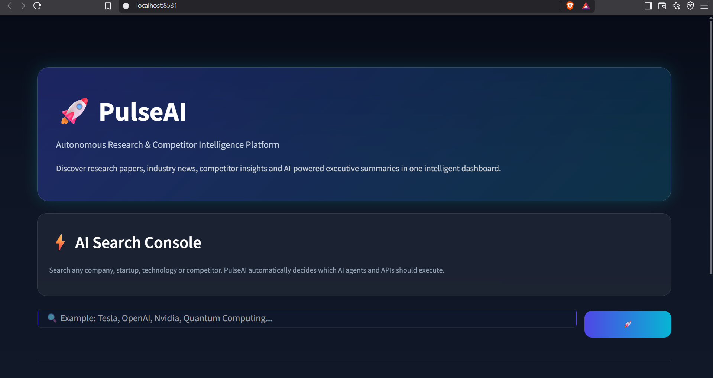
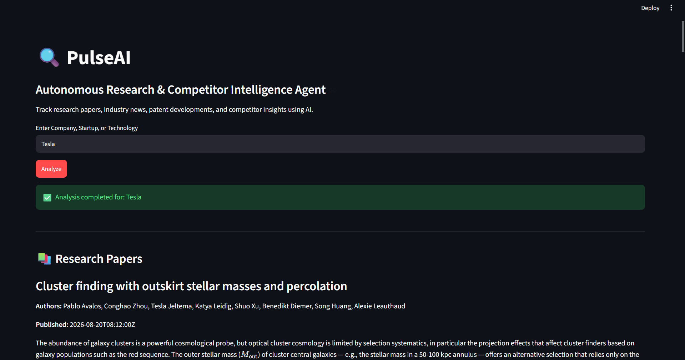

# 🔍 PulseAI

## Autonomous Research & Competitor Intelligence Agent

---

# 👥 Team Members

- **Saish Pardeshi** – Team Leader
- **Apurv Kulkarni**
- **Akash Zarekar**
- **Jay Bidwe**
- **Viren Mane**

---

# 📌 Problem Statement

Organizations, startups, and research institutions operate in highly competitive and rapidly evolving environments where staying updated on research trends, competitor strategies, patent developments, and industry news is critical. Manually monitoring multiple information sources is time-consuming, inefficient, and prone to missing important updates.

PulseAI addresses this challenge by automatically collecting research papers and industry news, then using Artificial Intelligence to generate concise, actionable insights that help users make informed decisions faster.

---

# 📖 Project Description

**PulseAI** is an AI-powered Research & Competitor Intelligence Agent built using **Python**, **Streamlit**, and **Google Gemini AI**.

Users simply enter a company name, startup, or technology keyword. The application automatically:

- 📚 Fetches the latest research papers from **arXiv**
- 📰 Collects recent industry news using **GNews API**
- 🤖 Uses **Google Gemini AI** to analyze the collected information
- 📊 Generates an executive summary with research trends, competitor insights, opportunities, risks, and recommended actions

This enables users to quickly understand recent developments without manually searching multiple websites.

---

# 🛠 Technologies Used

- Python
- Streamlit
- Google Gemini AI
- arXiv API
- GNews API
- Requests
- Feedparser
- Python Dotenv
- Git & GitHub

---

# ✨ Features

- 🔍 Search by Company, Startup, or Technology
- 📚 Latest Research Papers from arXiv
- 📰 Real-Time Industry News
- 🤖 AI-Powered Executive Summary
- 📈 Research Trend Analysis
- 🏢 Competitor Intelligence
- ⚠️ Risk & Opportunity Analysis
- 💡 Actionable Recommendations
- 🌐 Simple and Interactive Web Interface

---

# ✅ Task 2 – Dynamic Tool Calling

PulseAI includes an intelligent **Tool Router** that dynamically decides which external APIs should be used based on the user's query instead of calling every API for every search.

### Dynamic Tool Selection

| User Query | APIs Used |
|------------|-----------|
| **latest Tesla news** | 📰 GNews API + 🤖 Gemini AI |
| **AI research papers** | 📚 arXiv API + 🤖 Gemini AI |
| **OpenAI** | 📚 arXiv API + 📰 GNews API + 🤖 Gemini AI |

### Tool Routing Logic

- 📚 **arXiv API** → Retrieves the latest research papers.
- 📰 **GNews API** → Retrieves current industry news.
- 🤖 **Google Gemini AI** → Generates executive summaries and strategic insights.
- 🧠 **Tool Router** → Analyzes the user's query and intelligently selects the required APIs.

### Agent Decision

After every analysis, PulseAI displays:

- 🛠️ Tools Used
- 🧠 Agent Decision
- 📊 Dashboard Overview

This demonstrates transparent AI agent behavior by showing which external tools were selected and why, ensuring efficient and intelligent API usage.

---

# ⚙️ Installation / Setup

### 1. Clone the repository

```bash
git clone https://github.com/saish215p/hakathon.git
```

### 2. Navigate to the project folder

```bash
cd hakathon
```

### 3. Install dependencies

```bash
pip install -r requirements.txt
```

### 4. Create a `.env` file

Add your API keys:

```env
GNEWS_API_KEY=YOUR_GNEWS_API_KEY
GEMINI_API_KEY=YOUR_GEMINI_API_KEY
```

---

# ▶️ How to Run the Project

Run the following command:

```bash
python -m streamlit run app.py
```

The application will open in your browser at:

```
http://localhost:8501
```

Enter a company or technology keyword and click **Analyze** to generate AI-powered insights.

---

# 📸 Screenshots

## Home Page



## Analysis Results



## Api Dashboard

![Api Dashboard] (screenshots/Dashboard.png)


---

# 🚀 Future Scope

- Patent Database Integration
- Social Media Monitoring
- Google Scholar Integration
- Email Notifications
- Search History
- Trend Analytics Dashboard
- Multi-language Support

---

# 📄 License

This project was developed for a Hackathon and is intended for educational and demonstration purposes.

---

## ⭐ Thank You

Thank you for exploring **PulseAI**.

Built with ❤️ using **Python**, **Streamlit**, **Google Gemini AI**, **arXiv API**, and **GNews API**.